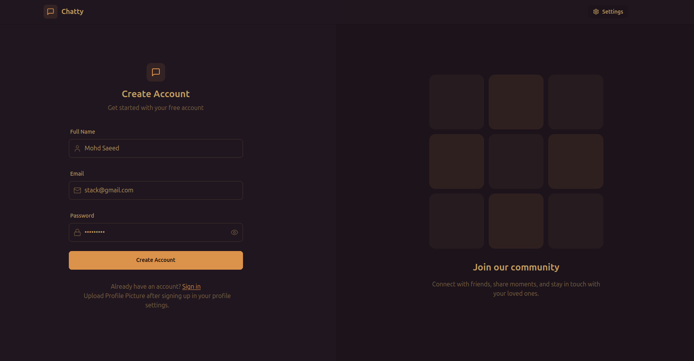

# 💬 Real-Time Chat Application

A full-stack real-time chat application built using modern web technologies, enabling seamless communication with features like authentication, group chats, and message status.

---

## 🚀 Features

- 🔐 User Authentication (Login / Signup)
- 💬 Real-time messaging using WebSockets
- 👥 Group chat functionality
- ✅ Message status (Seen / Delivered)
- ⚡ Fast and responsive UI
- 🔄 Live updates without refresh

---

## 🛠️ Tech Stack

### Frontend:
- React.js
- Tailwind CSS

### Backend:
- Node.js
- Express.js

### Realtime:
- Socket.io

### Database:
- MongoDB

---

## 📸 Screenshots



---

## ⚙️ Installation

```bash
git clone https://github.com/SYEDMDSAAD/Chat-S.io.git
cd Chat-S.io
