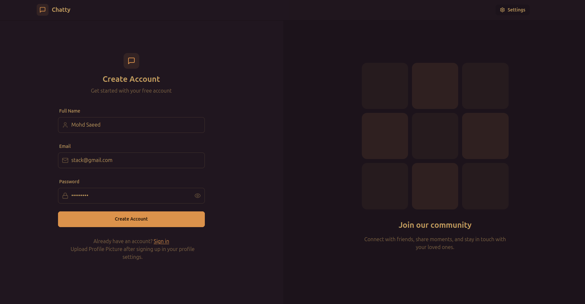

# 💬 Real-Time Chat Application

A full-stack real-time chat application built using modern web technologies, enabling seamless one-to-one communication with features like authentication, image sharing, online status, and message seen status.

---

## 🚀 Features

- 🔐 User Authentication (Login / Signup)
- 💬 Real-time messaging using WebSockets
- 🖼️ Image messages and profile pictures (Cloudinary)
- 🟢 Online / offline status and unread message counts
- ✅ Message status (Seen / Delivered)
- 🎨 32 selectable themes (DaisyUI)
- ⚡ Fast and responsive UI
- 🔄 Live updates without refresh

---

## 🛠️ Tech Stack

### Frontend:
- React.js
- Tailwind CSS

### Backend:
- Node.js
- Express.js

### Realtime:
- Socket.io

### Database:
- MongoDB

---

## 📸 Screenshots



---

## ⚙️ Installation

```bash
git clone https://github.com/SYEDMDSAAD/Chat-S.io.git
cd Chat-S.io
```

### Prerequisites
- Node.js 18+
- A MongoDB database (local or Atlas)
- A Cloudinary account (for image uploads)

## 🔧 Backend Setup

```bash
cd backend
npm install
cp .env.example .env   # then fill in the values
npm run dev            # starts on http://localhost:5001
```

| Variable | Description |
| --- | --- |
| `PORT` | Server port. The frontend expects `5001` in development. |
| `MONGODB_URI` | MongoDB connection string |
| `JWT_SECRET` | Secret used to sign login tokens |
| `NODE_ENV` | `development` or `production` |
| `CLOUDINARY_CLOUD_NAME`, `CLOUDINARY_API_KEY`, `CLOUDINARY_API_SECRET` | Cloudinary credentials |
| `CLIENT_URL` | Frontend origin allowed by CORS in development (default `http://localhost:5173`) |

Optionally seed demo users (password `123456` for all):

```bash
node src/seeds/user.seed.js
```

Or create two demo accounts (Aisha Khan and Rohan Mehta) with a ready-made conversation, handy for demos. Set `DEMO_PASSWORD` in `.env` first; re-running resets the conversation:

```bash
npm run seed:demo
```

## 🎨 Frontend Setup

```bash
cd frontend
npm install
npm run dev            # http://localhost:5173
```

## 🚢 Production

From the project root, build the frontend and start the backend, which serves it:

```bash
npm run build
NODE_ENV=production npm start
```

---

## 🌐 Live Demo
https://chat-s-io.onrender.com/

---

## 📂 Project Structure

```bash
.
├── backend
│   ├── src
│   │   ├── controllers
│   │   ├── lib
│   │   ├── middleware
│   │   ├── models
│   │   ├── routes
│   │   ├── seeds
│   │   └── index.js
│   ├── .env.example
│   ├── .gitignore
│   ├── package-lock.json
│   └── package.json
│
├── frontend
│   ├── public
│   ├── src
│   │   ├── components
│   │   ├── constants
│   │   ├── lib
│   │   ├── pages
│   │   ├── store
│   │   ├── App.jsx
│   │   ├── index.css
│   │   └── main.jsx
│   ├── README.md
│   ├── eslint.config.js
│   ├── index.html
│   ├── package-lock.json
│   ├── package.json
│   ├── postcss.config.js
│   ├── tailwind.config.js
│   └── vite.config.js
│
├── .gitignore
├── README.md
└── package.json
```

---

## 🤝 Contributing

Contributions are welcome! Feel free to open issues or submit pull requests.
⭐ If you like this project, give it a star!
